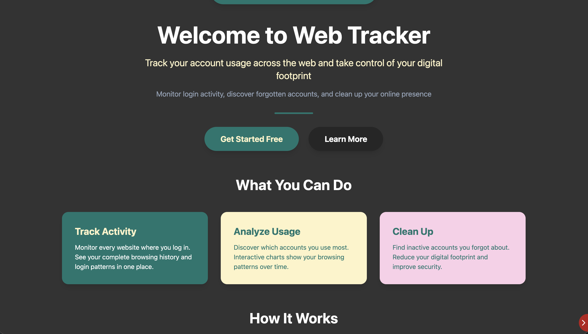
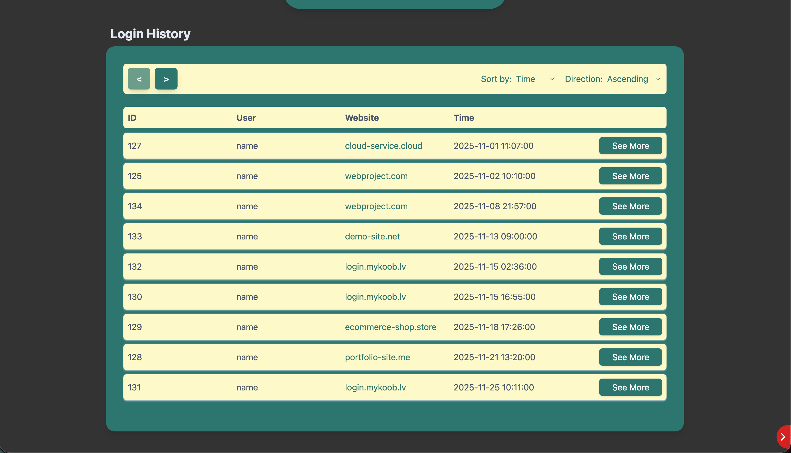
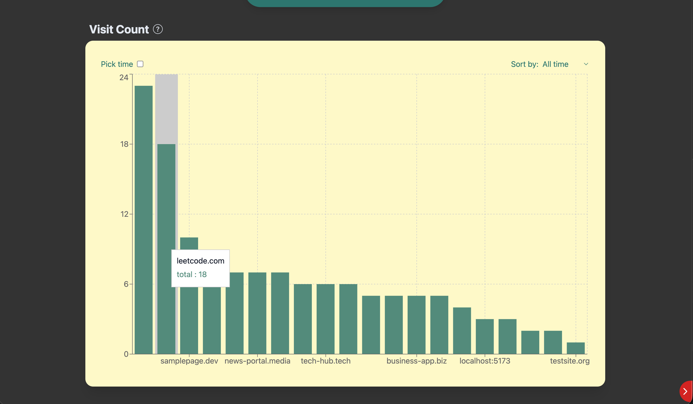
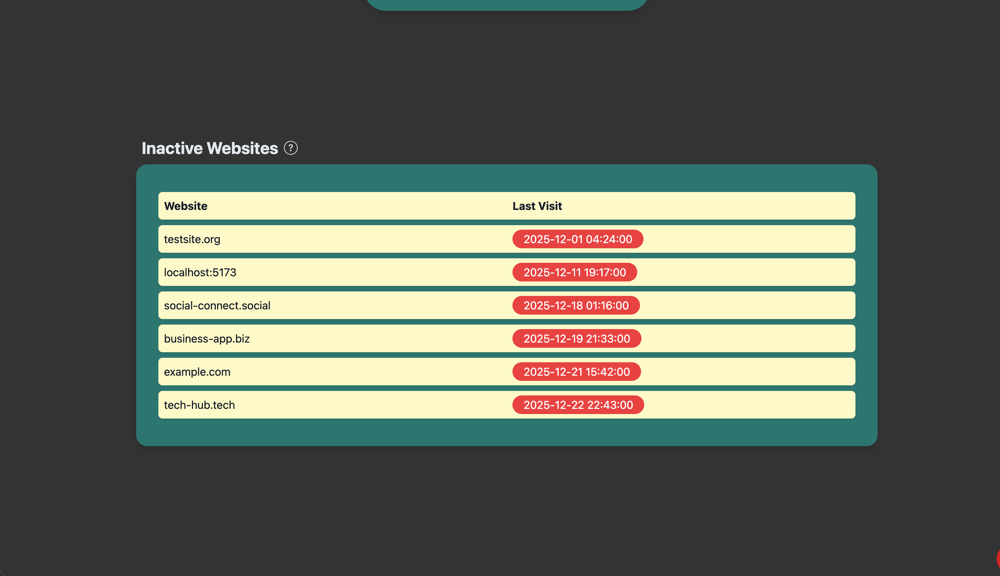
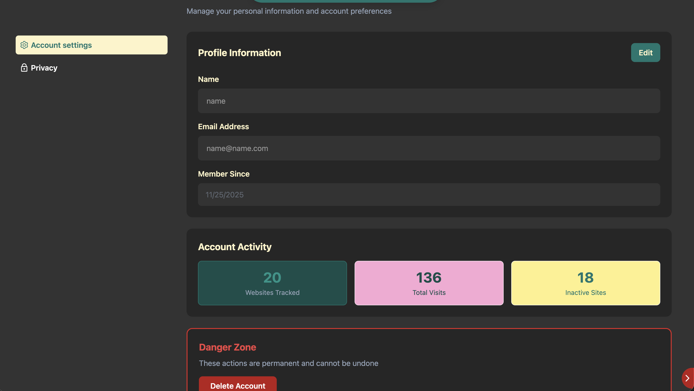
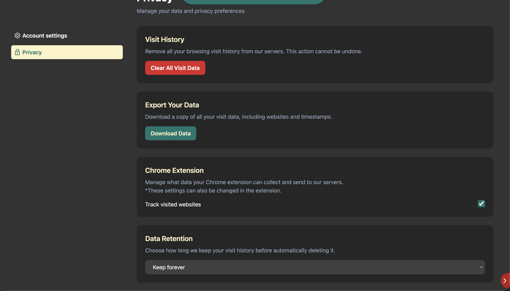

# Web Tracker

A full-stack web application that helps you monitor and manage your digital footprint across the internet. Track login activity, visualize browsing patterns, and clean up forgotten accounts - all from one centralized dashboard.

## Overview

Web Tracker automatically records when you log into websites through a browser extension, giving you complete visibility into your online presence. Discover which accounts you actually use, identify security risks from forgotten logins, and take control of your digital life.

## Features

### Activity Tracking
- Automatic detection of website logins via browser extension
- Complete history of all registered accounts
- Real-time tracking with zero manual effort

### Visual Analytics
- Interactive graphs showing your most-visited websites
- Account usage patterns and trends
- Statistical overview of your digital footprint

### Account Management
- Identify inactive websites you haven't visited recently
- Reduce your digital footprint for better privacy

### Security & Privacy
- Your data stays yours - complete control over tracked information
- Secure authentication with Laravel Sanctum
- Easy account deletion and history reset options

## Screenshots

*Home screen*

*Recent Website visit history*

*Most active websites graph*

*Websites you haven't used in a while*

*See your account summary, edit your account, and delete your account*

*Manage chrome extension settings, update your data retention policy for web tracker, and delete all of your history*

## Tech Stack

### Frontend
- **React** - UI framework with Vite build tool
- **React Router** - Client-side routing with nested routes
- **TailwindCSS v4** - Utility-first CSS framework
- **Axios** - HTTP client for API requests

### Backend
- **Laravel** - PHP framework for RESTful API
- **Laravel Sanctum** - Authentication system
- **MySQL** - Relational database

### Browser Extension
- **Manifest v3** - Modern extension architecture
- **Chrome/Firefox** - Cross-browser compatibility

## Installation

### Prerequisites
- Node.js (v16 or higher)
- PHP 8.1+
- Composer
- MySQL

### Backend Setup

- git clone https://github.com/karlisye/web_tracker.git
- cd ../back
- composer install
- cp .env.example .env
- php artisan key:generate
Update .env with your database credentials
- DB_CONNECTION=mysql
  DB_HOST=127.0.0.1
  DB_PORT=3306
  DB_DATABASE=web_tracker
  DB_USERNAME=root
  DB_PASSWORD=
- php artisan migrate
- php artisan serve

### Frontend Setup

- cd web_tracker/web
- npm install
- cp .env.example .env
- npm run dev

### Extension Setup

- cd ../extension
- npm install
- npm run build
Add the extension in chrome at chrome://extensions/ by enabling Developer mode, clicking unpack and selecting the dist folder.
Copy the extension ID and update the .env file in the web folder
- VITE_CHROME_EXTENSION_ID=copied_extension_id

